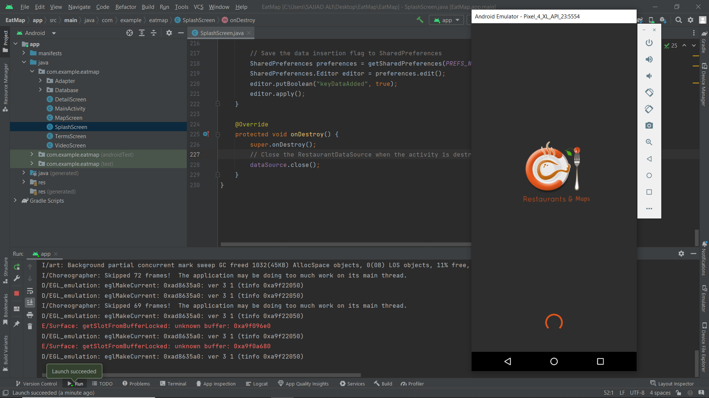
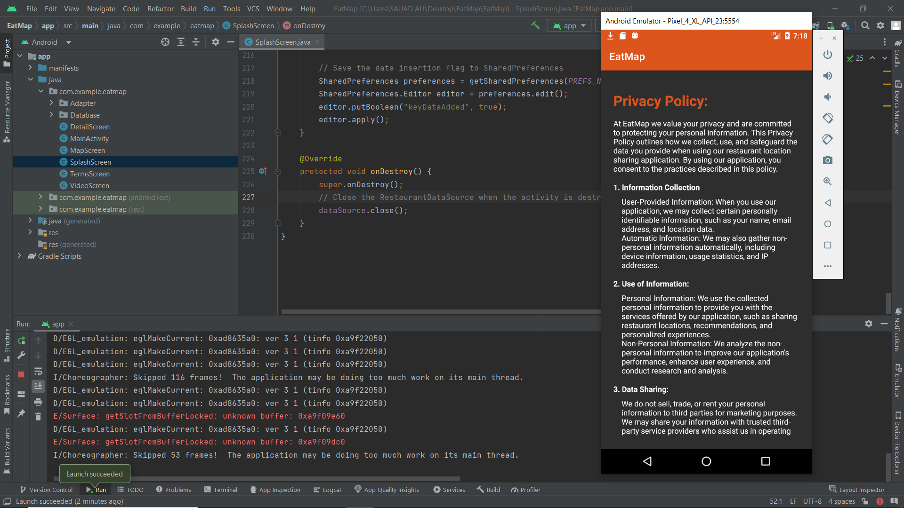
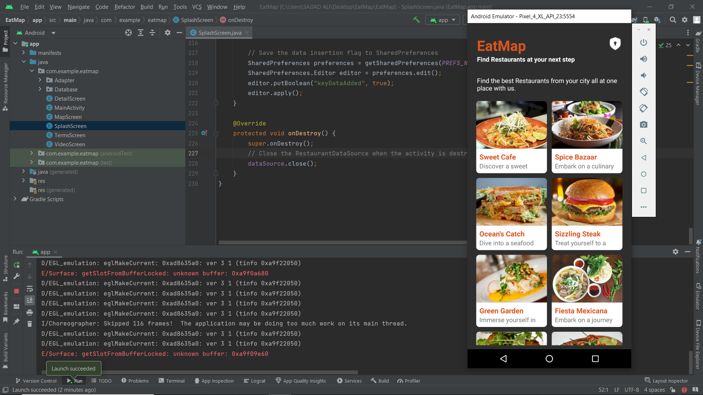
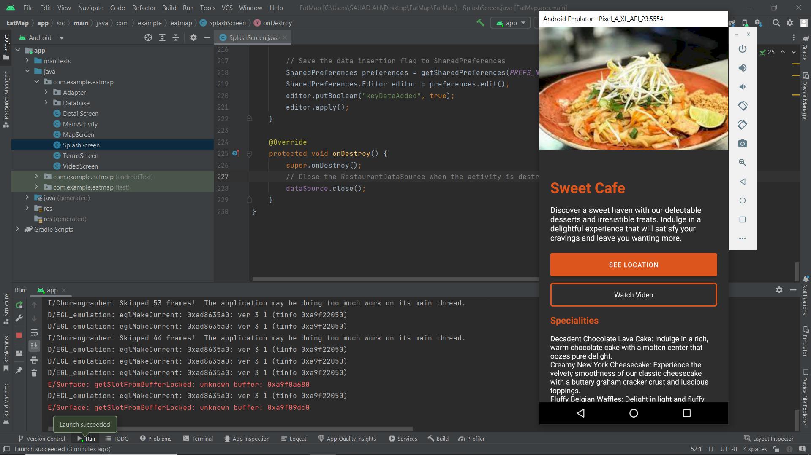
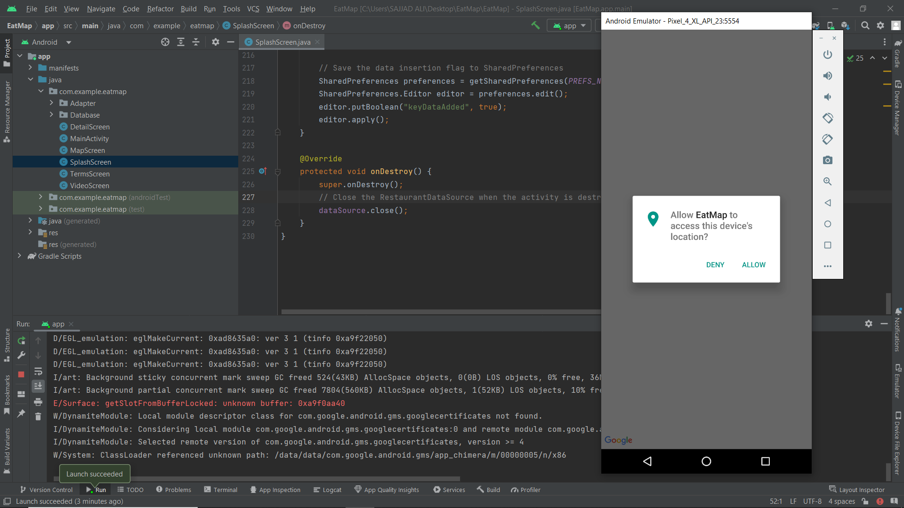
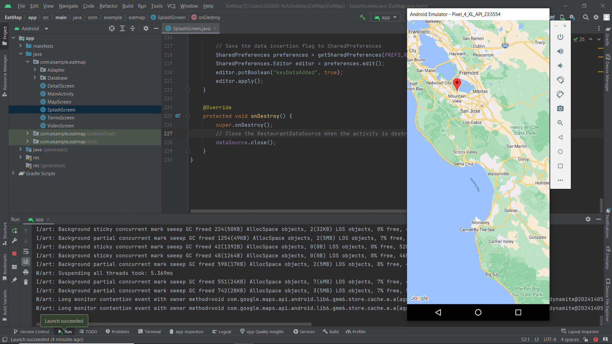
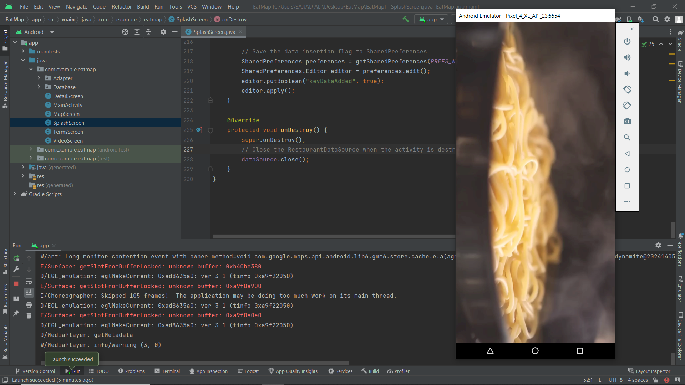

# EatMap

This is a Java application that provides you the information about different restaurants in a city that are stored locally in SQLite database and the user can see the details of all the provided restaurants and find the location and information about the restaurants and current location on the map.

<b>Applicatin Overview</b>

<b>1) Splash Screen</b>

<b>2) Privacy Screen</b>

<b>3) Home Screen</b>

<b>4) Details Screen</b>

<b>5) Permission Screen</b>

<b>6) Location Screen</b>

<b>5) Video Screen</b>

<b>Application Features</b>

<ol>
  <li>BackEnd: Java</li>
  <li>SQLite Database</li>
  <li>Google Map(API) Integration</li>
  <li>Attractive UI</li>
</ol>
